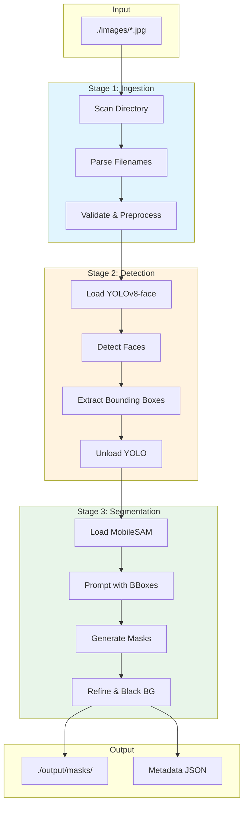

# Project Overview: Jiu-Jitsu Attendance CV Pipeline

## Executive Summary

This document outlines the architecture and design rationale for an automated computer vision pipeline that processes group photos of Jiu-Jitsu practitioners. The system extracts and segments individual faces (including hair) to produce clean, isolated masks suitable for downstream facial recognition and attendance tracking.

---

## 1. High-Level System Architecture

```
┌─────────────────────────────────────────────────────────────────────────────────┐
│                          DOCKERIZED ENVIRONMENT                                  │
│                    (NVIDIA Container Toolkit + CUDA 12.9)                        │
├─────────────────────────────────────────────────────────────────────────────────┤
│                                                                                  │
│  ┌──────────────┐    ┌──────────────────┐    ┌──────────────────┐               │
│  │   INPUT      │    │   PROCESSING     │    │     OUTPUT       │               │
│  │  ./images/   │───▶│     PIPELINE     │───▶│  ./output/masks/ │               │
│  │  (JPEG)      │    │                  │    │  (PNG segmented) │               │
│  └──────────────┘    └──────────────────┘    └──────────────────┘               │
│                              │                                                   │
│         ┌────────────────────┼────────────────────┐                             │
│         ▼                    ▼                    ▼                             │
│  ┌─────────────┐    ┌───────────────┐    ┌──────────────────┐                   │
│  │   STAGE 1   │    │   STAGE 2     │    │    STAGE 3       │                   │
│  │   Ingest    │───▶│   Detection   │───▶│  Segmentation    │                   │
│  │  & Preproc  │    │  (YOLOv8-face)│    │  (FastSAM/       │                   │
│  │             │    │               │    │   MobileSAM)     │                   │
│  └─────────────┘    └───────────────┘    └──────────────────┘                   │
│                                                                                  │
│  ┌──────────────────────────────────────────────────────────────────────────┐   │
│  │                        GPU MEMORY MANAGEMENT                              │   │
│  │                    RTX 4060 (8GB VRAM) Orchestrator                      │   │
│  └──────────────────────────────────────────────────────────────────────────┘   │
│                                                                                  │
└─────────────────────────────────────────────────────────────────────────────────┘
```

---

## 2. Detailed Pipeline Flow

### 2.1 Stage 1: Data Ingestion & Preprocessing

```
┌─────────────┐     ┌─────────────────┐     ┌───────────────────┐     ┌─────────────┐
│  Scan       │────▶│  Parse Filename │────▶│  Validate Image   │────▶│  Preprocess │
│  ./images/  │     │  YYYYMMDDH.jpg  │     │  (Format, Size)   │     │  for Models │
└─────────────┘     └─────────────────┘     └───────────────────┘     └─────────────┘
```

**Flow Description:**
1. **Directory Scanning**: Recursively scan `./images/` for JPEG files matching the naming convention
2. **Filename Parsing**: Extract date and session metadata from `YYYYMMDDH.jpg` pattern
3. **Chronological Sorting**: Order images by date and session for batch processing
4. **Validation**: Verify image integrity, minimum resolution thresholds, and format compliance
5. **Preprocessing**: Apply denoising/artifact reduction for WhatsApp-compressed images

### 2.2 Stage 2: Face Detection (YOLOv8-face)

```
┌───────────────┐     ┌───────────────────┐     ┌─────────────────┐     ┌──────────────┐
│  Load Image   │────▶│  YOLOv8-face      │────▶│  NMS & Filter   │────▶│  Extract     │
│  to GPU       │     │  Inference        │     │  Detections     │     │  Bounding    │
│               │     │  (640x640 tiles)  │     │  (conf > 0.5)   │     │  Boxes       │
└───────────────┘     └───────────────────┘     └─────────────────┘     └──────────────┘
```

**Flow Description:**
1. **Image Loading**: Load preprocessed image into GPU memory
2. **Tiled Inference** (if needed): For high-resolution images, process in overlapping tiles
3. **Detection**: Run YOLOv8-face inference to detect all visible faces
4. **Post-processing**: Apply Non-Maximum Suppression (NMS), confidence filtering
5. **ROI Extraction**: Output bounding boxes with coordinates and confidence scores

### 2.3 Stage 3: Zero-Shot Segmentation (FastSAM/MobileSAM)

```
┌───────────────┐     ┌───────────────────┐     ┌─────────────────┐     ┌──────────────┐
│  Unload YOLO  │────▶│  Load SAM Model   │────▶│  Prompt with    │────▶│  Generate    │
│  from VRAM    │     │  to GPU           │     │  Bounding Boxes │     │  Masks       │
└───────────────┘     └───────────────────┘     └─────────────────┘     └──────────────┘
        │                                                                       │
        │                                                                       ▼
        │                                               ┌──────────────────────────────┐
        │                                               │  Refine Mask (face + hair)   │
        │                                               │  Apply Black Background      │
        │                                               │  Crop & Save to Disk         │
        │                                               └──────────────────────────────┘
        │                                                               │
        ▼                                                               ▼
┌──────────────────────────────────────────────────────────────────────────────────────┐
│                              OUTPUT: ./output/masks/                                  │
│                     {original_filename}_{face_idx}_{bbox_hash}.png                   │
└──────────────────────────────────────────────────────────────────────────────────────┘
```

**Flow Description:**
1. **Model Swap**: Explicitly unload YOLOv8 and load SAM model (VRAM management)
2. **Prompt Engineering**: Feed each bounding box as a prompt to the SAM model
3. **Mask Generation**: Generate segmentation mask for face region
4. **Mask Refinement**: 
   - Ensure mask includes hair (expand region if needed)
   - Apply morphological operations for clean edges
5. **Background Removal**: Set all non-face/hair pixels to solid black (RGB: 0,0,0)
6. **Output**: Save cropped, masked face images to structured output directory

---

## 3. Technology Justifications

### 3.1 Zero-Shot Segmentation Approach

**Decision**: Use FastSAM or MobileSAM with bounding box prompts instead of training a custom segmentation model.

**Rationale**:

| Factor | Custom Model | Zero-Shot SAM | Decision Driver |
|--------|--------------|---------------|-----------------|
| Training Data | Requires 500+ annotated masks | None required | No annotated dataset available |
| Development Time | 2-4 weeks | Immediate | Prototype speed |
| Accuracy on Gi/Hair | Potentially higher | Good with prompt tuning | Acceptable for MVP |
| Generalization | Domain-specific | Broad generalization | Handles varied lighting/poses |
| VRAM Usage | ~2-4GB | ~1.5-3GB (MobileSAM) | Fits within constraints |

**Key Insight**: The combination of YOLOv8's accurate face bounding boxes as prompts enables SAM to produce precise face+hair segmentation without custom training. This approach trades marginal accuracy gains for significant reduction in development overhead and data requirements.

### 3.2 Model Selection: FastSAM vs. MobileSAM

| Model | VRAM Usage | Inference Speed | Quality | Recommendation |
|-------|------------|-----------------|---------|----------------|
| **MobileSAM** | ~1.5GB | ~50ms/mask | Good | **Primary choice** |
| FastSAM | ~2.5GB | ~80ms/mask | Good | Fallback option |
| SAM (ViT-H) | ~7GB | ~500ms/mask | Excellent | Not viable (VRAM) |

**Recommendation**: Start with **MobileSAM** due to lower VRAM footprint, allowing comfortable coexistence with YOLOv8 if sequential loading proves problematic.

---

## 4. Memory Management Strategy (8GB VRAM Constraint)

### 4.1 VRAM Budget Allocation

```
┌─────────────────────────────────────────────────────────────────────┐
│                    8GB VRAM BUDGET                                  │
├─────────────────────────────────────────────────────────────────────┤
│                                                                     │
│  ┌─────────────────────────────────┐  ┌───────────────────────┐    │
│  │      OPTION A: SEQUENTIAL       │  │  OPTION B: CONCURRENT │    │
│  │         (RECOMMENDED)           │  │     (RISKY)           │    │
│  ├─────────────────────────────────┤  ├───────────────────────┤    │
│  │                                 │  │                       │    │
│  │  Phase 1: YOLOv8-face           │  │  YOLOv8: ~1.5GB       │    │
│  │  ├── Model: ~1.5GB              │  │  MobileSAM: ~1.5GB    │    │
│  │  ├── Image: ~0.5GB              │  │  Image: ~0.5GB        │    │
│  │  ├── Workspace: ~1.0GB          │  │  Workspace: ~2.0GB    │    │
│  │  └── TOTAL: ~3.0GB              │  │  Buffer: ~2.5GB       │    │
│  │                                 │  │  TOTAL: ~5.5GB        │    │
│  │  [UNLOAD YOLO]                  │  │                       │    │
│  │                                 │  │  Risk: OOM on large   │    │
│  │  Phase 2: MobileSAM             │  │  images or many faces │    │
│  │  ├── Model: ~1.5GB              │  │                       │    │
│  │  ├── Image: ~0.5GB              │  └───────────────────────┘    │
│  │  ├── Masks: ~1.0GB              │                               │
│  │  └── TOTAL: ~3.0GB              │                               │
│  │                                 │                               │
│  │  Peak Usage: ~3.5GB             │                               │
│  │  Safety Buffer: ~4.5GB          │                               │
│  └─────────────────────────────────┘                               │
│                                                                     │
└─────────────────────────────────────────────────────────────────────┘
```

### 4.2 Memory Management Tactics

1. **Sequential Model Loading**: Load YOLOv8, process all detections, explicitly unload, then load SAM
2. **Explicit Garbage Collection**: Call `torch.cuda.empty_cache()` between model swaps
3. **Batch Size Control**: Process faces in batches of 8-16 for SAM prompting
4. **FP16 Inference**: Use half-precision where supported to halve memory footprint
5. **Image Downscaling**: Limit input resolution to 2048px on longest edge

### 4.3 Fallback Strategy (OOM Prevention)

```
IF VRAM usage > 7GB:
    1. Reduce batch size to 1
    2. Force FP16 mode
    3. Process image in tiles
    4. If still failing: fall back to CPU for SAM (slower but stable)
```

---

## 5. Performance Budget (2-Minute Constraint)

### 5.1 Time Budget Allocation per Image

| Stage | Estimated Time | % of Budget | Notes |
|-------|---------------|-------------|-------|
| Data Loading & Preprocessing | 2-5s | 4% | I/O bound |
| YOLOv8-face Detection | 5-15s | 12% | Depends on resolution |
| Model Swap (YOLO → SAM) | 3-5s | 4% | Includes GC |
| SAM Segmentation (per face) | 0.5-1s | Variable | ~50ms × N faces |
| Post-processing & Saving | 5-10s | 8% | I/O + CPU operations |
| **Buffer** | ~30s | 25% | Safety margin |

### 5.2 Worst-Case Scenario Analysis

**Assumptions**:
- Image resolution: 4032 × 3024 (typical smartphone)
- Number of faces: 30 (large group class)
- WhatsApp compression: Yes

**Estimated Processing Time**:
```
Loading:       3s
Preprocessing: 5s
YOLO:         15s (tiled inference)
Model Swap:    5s
SAM (30×1s):  30s
Postprocess:  10s
Saving:        5s
─────────────────
TOTAL:        73s (~1.2 minutes)
```

**Verdict**: Comfortably within the 2-minute budget with ~45s buffer.

---

## 6. Output Specifications

### 6.1 Output Directory Structure

```
./output/
├── masks/
│   ├── 20231027/                    # Date-based organization
│   │   ├── session_1/               # Session grouping
│   │   │   ├── 202310271_face_001_a1b2c3.png
│   │   │   ├── 202310271_face_002_d4e5f6.png
│   │   │   └── ...
│   │   └── session_2/
│   │       └── ...
│   └── 20231028/
│       └── ...
├── metadata/
│   └── processing_log.json          # Processing timestamps, counts, errors
└── debug/                           # Optional: intermediate visualizations
    └── detections/
        └── 202310271_detections.jpg
```

### 6.2 Output File Naming Convention

**Pattern**: `{original_stem}_face_{index:03d}_{bbox_hash}.png`

- `original_stem`: Original filename without extension (e.g., `202310271`)
- `index`: Zero-padded face index (001, 002, ...)
- `bbox_hash`: 6-character hash of bounding box coordinates for uniqueness

### 6.3 Output Image Specifications

| Property | Value | Rationale |
|----------|-------|-----------|
| Format | PNG | Lossless, supports transparency |
| Color Space | RGB | Standard for downstream models |
| Background | Solid Black (0,0,0) | Clean mask, easy to process |
| Resolution | Original crop size | Preserve detail for AdaFace |
| Min Dimension | 112px | AdaFace minimum requirement |

---

## 7. Error Handling Philosophy

### 7.1 Graceful Degradation Principles

1. **No Single Image Failure Stops the Pipeline**: Log errors, skip problematic images, continue processing
2. **Partial Results Are Valid**: If 28/30 faces segment successfully, save the 28
3. **Comprehensive Logging**: Every decision, skip, and error is logged with context
4. **Idempotent Processing**: Re-running on same input produces same output (skip already processed)

### 7.2 Error Categories

| Category | Example | Action |
|----------|---------|--------|
| **Recoverable** | Low confidence detection | Log warning, include in output with flag |
| **Skippable** | Corrupted image file | Log error, skip image, continue |
| **Fatal** | GPU driver failure | Log critical, graceful shutdown, notify |

---

## 8. Key Design Decisions Summary

| Decision | Choice | Alternative Considered | Rationale |
|----------|--------|------------------------|-----------|
| Segmentation Approach | Zero-shot SAM | Custom U-Net | No training data |
| SAM Variant | MobileSAM | FastSAM, SAM-H | VRAM efficiency |
| Model Loading | Sequential | Concurrent | OOM prevention |
| Precision | FP16 | FP32 | Memory savings |
| Processing Strategy | Per-image | Batch | Memory predictability |
| Output Format | PNG | JPEG | Lossless quality |

---

## Appendix A: Model Specifications

### YOLOv8-face
- **Source**: Ultralytics (with face-specific weights)
- **Input Size**: 640×640 (internal scaling)
- **VRAM**: ~1.5GB (FP16)
- **License**: AGPL-3.0

### MobileSAM
- **Source**: Segment Anything (Mobile variant)
- **Encoder**: TinyViT
- **VRAM**: ~1.5GB
- **License**: Apache 2.0

---

## Appendix B: Mermaid Architecture Diagram



---

*Document Version: 1.0*  
*Last Updated: 2026-03-28*  
*Author: CV Pipeline Planning*
